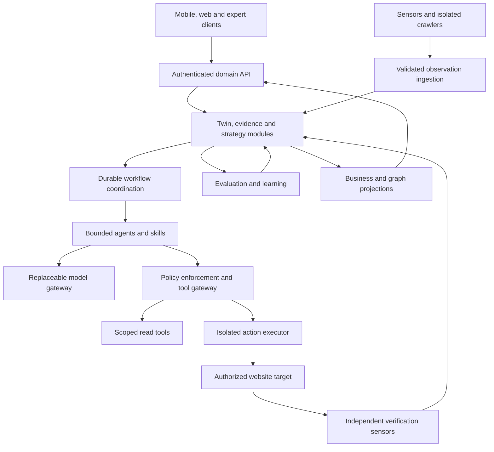

# 12 — Technical Architecture Proposal

Status: proposed, workload-driven architecture. No dependency versions, cloud vendor, commercial service or deployment is approved by this document. Acceptance gates are in [13](13-IMPLEMENTATION-DEPENDENCIES.md).

## 1. System shape

Start with a modular transactional control plane and separately deployable workers for distinct security/resource workloads. This preserves coherent domain transactions without placing hostile rendering, model reasoning and privileged writes in one trust boundary. Logical modules are not automatically microservices.

Every arrow across a trust boundary carries authenticated scope and typed contracts. The diagram represents responsibilities; it does not authorize direct database writes from every component.

## 2. Module and storage ownership

| Logical module | Owns / consumes | Runtime boundary |
| --- | --- | --- |
| Access and asset registry | Membership, site scope, ownership, grants, connector references | Control plane; secrets broker separated |
| Perception | Crawl frontier, collection runs, artifacts and coverage | HTTP workers and separately sandboxed render workers |
| Evidence and world model | Observations, claims, belief history, Twin and graph assertions | Transactional domain core |
| Opportunity and Strategy | Priority assessments, portfolio revisions, decision manifests | Core with bounded compute activities |
| Workflow coordination | Scheduling, retries, timers, approvals waiting, cancellation | Durable orchestration infrastructure |
| Skills and Agent Runtime | Approved release resolution, assignments, constrained inference | Unprivileged workers |
| Policy and Actions | Enforcement, exact proposals, approvals, attempt ledger, receipts | Restricted executor with credential broker |
| Evaluation and Learning | Frozen designs, verification, outcomes, promoted learning | Independent jobs and restricted evaluative permissions |
| Interpretation and projections | Business cards, inbox, expert read models, graph neighborhoods | Read-focused API/projection workers |

Modules own their tables and expose commands/queries. In-process calls can share a transaction where needed; other changes use domain events and outbox. Avoid a generic entity/value database for everything: stable transactional aggregates deserve typed schemas, while claim predicates and skill registries allow controlled extension.

## 3. Technology decisions and alternatives

| Decision / proposed choice | Workload and architectural justification | Trade-off, alternative and acceptance gate |
| --- | --- | --- |
| Primary store: PostgreSQL candidate | Tenant-scoped transactions, integrity constraints, approvals, optimistic revisions, temporal records and transactional outbox | RLS is defense in depth; test application and worker roles. Start with relational graph edges; accept only after temporal/query and isolation proofs |
| Evidence: private object storage with lifecycle and encryption | HTML, DOM, screenshots and provider payloads are large immutable artifacts; transactional rows retain hashes and references | Choose provider by region, retention, recovery and access controls. Do not store every binary in relational rows or duplicate without limits |
| Orchestration: Temporal candidate | Work spans retries, human approval waits, provider outages and delayed evaluation; explicit durable histories and timers | Operational cost and workflow versioning matter. Compare with a database-backed durable state machine; require crash/replay/upgrade proof before selecting |
| Initial messaging: transactional outbox plus workflow task delivery | Moderate event fan-out with authoritative SQL state and reliable job dispatch | No separate streaming broker initially. Add one only when measured fan-out, retention/replay or throughput requirements exceed this design |
| Graph: typed relational assertions and bounded recursive queries first | Evidence-centric one/few-hop exploration, stable transactional provenance and tenant filtering | PostgreSQL supports recursive queries [S2]. Benchmark real query shapes. Dedicated graph projection is justified only by measured traversal/algorithm needs |
| Retrieval: lexical search first, optional vector index | Retrieve evidence and similar cases; exact query, URL and entity lookup remains central | Embeddings are derivative and privacy-scoped. Add vectors only when retrieval evaluations improve over lexical/structured baselines |
| Rendering: Playwright-controlled Chromium candidate | Capture DOM, network failures, screenshots and browser-context differences reproducibly | Contexts isolate browser state [S4], not hostile code at OS level. Require separate sandbox/network enforcement and cost tests |
| HTTP crawl: bounded HTTP client plus HTML parser | High-volume discovery needs low cost per page; most observations do not require a browser | Runtime/library selected after robots, compression, encoding, URL and egress tests. Keep browser and HTTP scheduling separate |
| Domain/API workers: TypeScript on a supported Node.js release candidate | I/O-heavy connectors, typed contracts shared with clients, browser automation integration | This is an engineering recommendation, not a scalability claim. Python workers are optional for statistical workloads; avoid dual-language core without need |
| API: versioned HTTP/JSON commands and query projections, schema-generated clients | Mobile retries, exact approval versions and several client surfaces need stable contracts | Async commands return durable operation IDs. Choose framework after auth, validation, observability and worker compatibility are proven |
| Mobile: React Native candidate; web/expert: React candidate | Native mobile interaction and shared typed contracts; expert graph/large tables need browser-oriented layouts | React Native exposes native UI components [S8]. Validate accessibility, secure local storage, push, deep links and performance; share domain contracts, not every screen |
| Policy: typed deterministic policy module behind an enforcement interface | Frequent per-action decisions must be testable, versioned and fail closed | A dedicated policy engine is optional if authoring/distribution complexity requires it; never rely solely on an LLM judge |
| Model gateway: internal provider-neutral interface | Reasoning quality, privacy, costs and availability vary by task | Validate capabilities per adapter. Preserve provider-specific features behind explicit optional contracts rather than an impoverished universal prompt |
| Operations: OpenTelemetry-compatible traces, metrics and logs | Correlate asynchronous work across API, sensors, inference and deployment | OTel is vendor-neutral telemetry infrastructure [S5]; business audit evidence still lives in the domain ledger |
| Hosting: managed regional database/object storage and container workers candidate | Long jobs, isolated renderers, controlled egress and recovery need predictable execution | Provider, residency and costs remain undecided. Kubernetes or many microservices require demonstrated operational need |

PostgreSQL row security can default-deny where enabled without a matching policy, but owners and privileged roles can bypass it [S1]. Use dedicated non-owner application roles, appropriate forced policies, scoped transactions and composite constraints; test migrations, support roles and connection-pool reuse. RLS does not protect objects, queues or model prompts.

Temporal provides durable workflow execution semantics [S3]; that does not make remote CMS effects exactly once. Domain receipts, conditional writes and reconciliation remain necessary. Keep inference/network calls in recorded activities rather than deterministic workflow logic.

## 4. Crawl and sensor architecture

An observation run records authorization scope, collection configuration, budgets, coverage, source revisions and completion status. A crawl frontier admits URLs from permitted seeds, links and sitemaps; respects applicable crawl policies; deduplicates conservatively; avoids faceted/calendar traps; and enforces per-origin politeness and concurrency.

Collect HTTP status/headers, redirects, links, canonicals, robots directives, structured data and content fingerprints. Save sufficient artifacts to substantiate claims. Prioritize protected assets, changed pages and representative templates. Incremental crawling uses prior fingerprints and last observations; periodic coverage checks catch missed pages.

Rendered collection is a second lane triggered by evidence needs or sampling, with explicit browser/device/locale, timeouts and readiness conditions. Save raw/rendered differences and incomplete render states. Google's documentation distinguishes crawling, rendering and indexing [S6]; a local renderer must never label its output “Google's indexed DOM.”

All outbound access, including subresources and redirects, passes the egress policy in 11. A failed or excluded URL is not a removed page. Partial completion and budget deferral are first-class outputs.

## 5. Platform integration and intelligence contracts

| Integration family | Required contract / interpretation |
| --- | --- |
| Google Search Console | Property mapping, minimal scopes, quota policy, query dimensions, aggregation, source timezone, completeness and revision handling |
| URL Inspection | Per-URL provider observation and observation date; do not confuse stored index information with a general live test [S7] |
| Bing Webmaster | Separate provider adapter, verified account/site mapping, authentication, methods and quota contract; do not infer parity with Google |
| IndexNow | Key/location verification, host scope, response receipt and rate handling [S9]; submission is a signal, not proof of indexing or growth |
| Analytics | Versioned event/goal definitions, attribution model, consent/coverage, currency and timezone; no private metrics without access |
| SERP/competitor provider | Licensed collection/use, query/location/device/time/result-type context, coverage and cost; cannot claim universal rank |
| AI-search visibility | Surface/model/version/prompt and sampling method; probabilistic observations, no universal AEO visibility score |
| CMS/git execution | Allowed resources, preview, concurrency token, receipt reconciliation, verification and conditional compensation |

Provider quotas and method availability are configuration/evidence, not guessed constants. Official Bing API detail was not successfully retrievable in this review; concrete methods, authentication and limits remain an integration gate. No claim of a completed provider contract is made.

Integration credentials are replaceable via a connection lifecycle: connect → verify mapping → activate → degraded/expired/revoked → reconnect. Data remains historically identifiable after disconnection subject to retention; scheduled work pauses explicitly.

## 6. Model and agent architecture

The Model Gateway accepts a task class, versioned input schema, evidence bundle, allowed output schema, privacy/routing constraints and budget. It returns structured output, provider/model identifier, adapter/config version, usage, latency, errors and validation status.

Model outputs are proposals. Evidence extraction, planning and business interpretation have separate evaluation suites. Provider fallback must satisfy the same data policy and task-quality requirements; inability to satisfy them defers the work. A fallback never upgrades permissions or silently sends data to an unapproved region/provider.

Agent specialization is a bounded assignment with a skill manifest, budget and expected artifact, not a mandatory always-running process for every name in 04. Strategy owns plan priorities; specialists submit findings. Runtime limits recursion, tool calls, fan-out and spend. Record rationales and structured tool traces without requiring hidden reasoning disclosure.

## 7. Real graph and simple clients

The graph API serves an authorized neighborhood with entity IDs, assertion IDs, provenance, belief status, valid/recorded times, projection watermark and pagination/truncation metadata. A time selector supports current versus as-known-then views. Graph aggregates expose counts and filters so clusters do not imply nonexistent edges.

Start with bounded neighborhoods and progressive expansion. Candidate visual renderer selection needs mobile GPU, accessibility and layout benchmarks; a table/list alternative must expose the same data. Motion follows actual accepted events. No synthetic “thinking” activity or fabricated nodes.

“Backend speaks SEO. Frontend speaks business.” The business projection converts domain decisions into: what matters, proposed/finished work, why, expected benefit, uncertainty, risk, decision required, and evidence on demand. It must not promote an estimate to a measured result.

Home/Brain/Inbox/You remain the default mobile organization from 06. The cloud continues while the client is closed. Cached cards show freshness; push notifications contain minimal sensitive data and deep-link to authenticated current state. Customer web uses the same business semantics. Expert Console exposes deeper domain diagnostics through role-gated APIs, not direct database access.

## 8. Reliability, capacity and cost gates

Do not select scale infrastructure without a declared envelope. Agree tenants, sites per tenant, pages/site, recrawl cadence, render fraction, SERP contexts, retention, concurrent approvals and latency targets.

Sizing model: daily fetches = active sites × average in-scope pages × recrawl fraction; render work = daily fetches × render fraction × average browser seconds. Add retries, backfills and protected-asset checks. Model cost = task counts × measured tokens/call × provider unit cost, plus retries; total budget includes storage, data providers and human review. These are planning formulas, not measured forecasts.

Track cost per site/cycle, freshness lag, collection coverage, decision latency, approval age, verification lag and unresolved remote outcomes. Quality degradation should reduce discretionary work, preserve protection checks and disclose missing evidence. It must not make stale facts look fresh.

Before production, set and test availability, RPO/RTO, recovery consistency, tenant isolation, deletion recovery, provider outage behavior and overload fairness. Split services or add analytical/graph/streaming stores only against measured bottlenecks with a migration/rebuild plan.

## 9. Primary sources consulted

Accessed during this review on 2026-09-13 UTC. URLs are refreshable references, not permanent snapshots or evidence that an implementation exists.

- S1: [PostgreSQL row security](https://www.postgresql.org/docs/current/ddl-rowsecurity.html).
- S2: [PostgreSQL recursive queries](https://www.postgresql.org/docs/current/queries-with.html).
- S3: [Temporal workflow execution](https://docs.temporal.io/workflow-execution).
- S4: [Playwright browser-context isolation](https://playwright.dev/docs/browser-contexts).
- S5: [OpenTelemetry overview](https://opentelemetry.io/docs/what-is-opentelemetry/).
- S6: [Google JavaScript SEO processing](https://developers.google.com/search/docs/crawling-indexing/javascript/javascript-seo-basics).
- S7: [Google URL Inspection API](https://developers.google.com/webmaster-tools/v1/urlInspection.index/inspect).
- S8: [React Native native components](https://reactnative.dev/docs/intro-react-native-components).
- S9: [IndexNow documentation](https://www.indexnow.org/documentation).

These sources support the narrowly stated capability facts. The system shape, boundaries and choices above are engineering proposals derived from AIOS-SEO's requirements.
