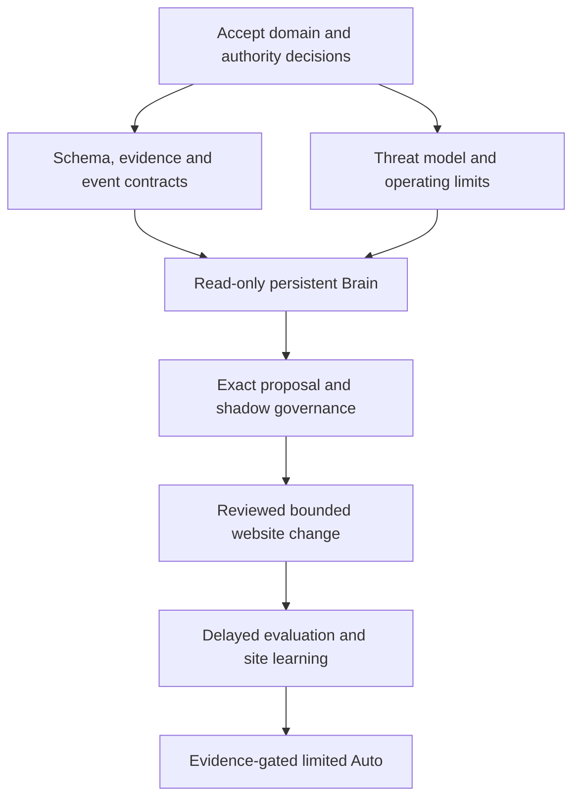

# 13 — Implementation Dependencies

Status: decision and specification backlog. This document authorizes neither scaffolding nor external website changes. Owner labels below are accountable roles to assign, not claims that a team exists.

## 1. Decisions required before implementation

| ID | Decision and recommended starting position | Owner | Blocks / acceptance evidence |
| --- | --- | --- | --- |
| D01 | Accept 08–11's responsibility, truth and temporal clarification; retain 00–06 as product intent | Product + architecture + SEO | Domain implementation; ADR explicitly resolves R01 and distinguishes facts from policy |
| D02 | Tenant/business/site/property identity, agency roles, verified control and exact write scopes | Security + domain | Access/schema foundation; reviewed permission matrix and two-tenant scenarios |
| D03 | First customer archetype and first complete vertical slice; recommend a small single-site service business with a measurable enquiry goal | Product + SEO | Prioritization/metric contracts; confirm locale, site size, use case and protected assets |
| D04 | One initial execution adapter and exact eligible action class; recommend one-page title consistency only where source/version control is reliable | Execution + product | Any website mutation; preview, compare-and-set, reconciliation and conditional recovery contract |
| D05 | Initial autonomy Review; assign approvers, expert escalation and hard block rules | Security + SEO + product | External writes; accepted policy matrix and operational responsibility |
| D06 | Data region, classification, retention, deletion, support access and provider data-use rules | Security + product | Production data handling; accepted data lifecycle and threat model |
| D07 | Workload envelope, per-site budget, availability and recovery objectives | Platform + product | Physical sizing and production operations; measured fixture plan and accepted limits |
| D08 | Accept or replace PostgreSQL/object-store/orchestrator/runtime candidates after bounded proofs | Engineering | Platform scaffolding; ADR with failure tests, operating burden and costs |
| D09 | Qualified visibility/conversion definitions, experiment method and uncertainty rules for D03 | Analytics + SEO | Outcome/learning implementation; frozen example evaluation and confounder handling |
| D10 | Knowledge and skill release/revocation owners, freshness rules and evaluation criteria | SEO + evaluation + platform | Skill runtime and governed reasoning; complete release manifest and update example |
| D11 | Provider access, quotas, licensing and capabilities for first Google/Bing/SERP scope | Integrations + product | Each affected connector; verified sandbox/account contract, coverage and outage examples |
| D12 | Promotion criteria for learning and Auto; global learning remains disabled initially | Evaluation + security | Auto and shared learning; predeclared cohort, sample adequacy and error bounds |

D01/D02/D06/D08 define the foundational implementation boundary. D03/D07/D10 make that foundation meaningfully scoped. D04/D05 are hard gates before writes; D09/D12 before outcome-driven learning or Auto. D11 blocks its respective integration, not URL-only first value. Some decisions can be resolved together; do not pretend all later features block a read-only slice.

## 2. Additional specifications to author next

The seven documents 07–13 are a logical foundation. The following are required implementation contracts, not missing work silently delegated to a coder.

| Spec ID / proposed artifact | Minimum content | Depends on |
| --- | --- | --- |
| S01 / ADR register | Accepted/proposed/rejected status, owners, alternatives, dated decisions, supersession | D01–D12 as applicable |
| S02 / Physical domain and access schema | Aggregate schemas, keys, tenant constraints, temporal indexes, transactions, deletion and migrations | D01, D02, D06, D08 |
| S03 / Threat model and permission matrix | Actors, trust boundaries, ownership proofs, agency/support roles, injection/SSRF tests, credential paths | D02, D05, D06 |
| S04 / Evidence and event schemas | JSON schemas, units/grain, missingness, evidence locators, compatibility, correction/replay fixtures | D01, D08 |
| S05 / First sensor and connector contracts | Auth/scopes, crawl rules, quotas, pagination, coverage, source periods, errors, consent and fixtures | D03, D07, D11 |
| S06 / Skill and tool release contract | Exact first skill, source manifest, I/O, validators, capability scopes, versioning, revocation and evaluations | D04, D05, D10 |
| S07 / Workflow and action protocol | Transition guards, ownership, retries, leases, approval binding, partial/unknown writes and compensation | S02–S06 |
| S08 / Metrics and evaluation protocol | Archetype-specific outcomes, baseline, minimum data, protected wins, confounders, frozen analysis and learning | D03, D09, D12 |
| S09 / Capacity, cost and recovery plan | Load envelope, SLOs, admission limits, alerts, RPO/RTO, backup/restore/deletion drills and on-call ownership | D06–D08 |
| S10 / Client and graph API contracts | Business card schema, stale/offline approvals, expert roles, graph paging/time/provenance, accessibility acceptance | S02, S04, S07, S08 |

Assign filenames/numbers when these are actually authored; none is asserted to exist. Resolve the contracts with examples and counterexamples, not more layers of aspirational prose.

## 3. Dependency order and exit gates

| Stage | Deliverable after explicit implementation instruction | Exit evidence |
| --- | --- | --- |
| 0: specification closure | Accepted ADRs and S02–S06 minimum contracts | Two end-to-end domain traces, including contradiction and permission denial |
| 1: persistent understanding | URL discovery, evidence store, provisional Twin, real graph, durable cycle and business summary | Restart retains continuity; tenant isolation; uncertainty/coverage exposed; no fabricated facts |
| 2: strategy and shadow action | One opportunity model, competing options, pinned skill, exact preview, policy result and simulated execution | All outputs trace to evidence; stale proposal denied; no uncontrolled tools |
| 3: reviewed execution | One authorized connector/action class, receipts, independent verification and conditional compensation | Crash, duplicate, partial and concurrent-human-edit scenarios pass; no automatic deployment |
| 4: measurement and learning | Frozen observation design, delayed data handling, evaluations and tenant-local learning | Inconclusive outcomes supported; old decisions unchanged; corrections and confounders visible |
| 5: bounded Auto | Explicit limited grants for proven cohorts and independent stop controls | D12 criteria met; regression revokes autonomy; recovery and support ready |
| 6: breadth and scale | Additional archetypes, skills, platforms and richer graph analysis | Each expansion earns sensor/evidence/action/evaluation coverage and workload justification |

This first slice is deliberately narrow in coverage and complete in architectural continuity. It should demonstrate Understand → Observe → Diagnose → Prioritize → Strategize → Act → Verify → Measure → Learn → Repeat without promising statistically detectable growth from one edit.

Do not wait for a native app to validate evidence contracts, but do not replace the mobile-first product with an expert dashboard. Stage 1 client prototypes must use the proposed business projection and authentic graph data once implementation is authorized.

## 4. Canonical SEO universe coverage

Every family in 02 remains in scope. “Later” means a dependency gate, not removal from the product. Each addition must specify Observe → Evidence → Diagnose → Skill → Decide → Action → Risk → Validate → Measure → Learn.

| 02 family | Architectural home | Specific readiness dependency |
| --- | --- | --- |
| 1 Business context | Twin | Confirmed versus inferred fields; archetype contract |
| 2 Customer/problem/intent | Twin + graph | Intent ontology and customer validation |
| 3 Demand/keywords/topics/entities | Demand sensors + opportunity | Licensed sources, uncertainty and entity resolution |
| 4 Crawl discovery | Perception | Frontier scope, politeness, coverage and traps |
| 5 Indexability/coverage | Evidence + platform sensors | Distinguish eligibility, provider index state and unknown |
| 6 HTTP/redirects/migrations | Technical skill + Actions | Dependency blast radius and migration recovery |
| 7 URL/canonicalization | Inventory + assertions | Versioned normalization; no destructive canonical merge |
| 8 Robots/snippet controls | Policy + technical skills | High-impact rule evaluation and expert routing |
| 9 Sitemaps/freshness | Sensors + skills | Source reconciliation and truthful modification dates |
| 10 JavaScript | Isolated renderer | Raw/render context, sandbox and resource budget |
| 11 Architecture/navigation | Graph + strategy | Sitewide dependencies and protected-asset checks |
| 12 On-page relevance | Skills + Actions | Exact revisioned preview and content truth |
| 13 Content quality/decay | Content skills + evaluation | Originality/usefulness rubrics, source rights and refresh evidence |
| 14 Internal links | Graph + Actions | Link evidence, spillover and conditional recovery |
| 15 Structured data | Typed validators + skills | Applicable current schema/platform rules and factual consistency |
| 16 Image/video | Media sensors + skills | Asset identity, extraction/rights and surface metrics |
| 17 Performance/mobile | Performance sensors | Lab/field distinction, device cohort and repeatability |
| 18 Local | Twin + local connectors | Verified location identity, permissions and local context |
| 19 Ecommerce | Offering graph + adapters | Variants/facets/inventory and transactional protected assets |
| 20 International | Locale graph + skills | Language/region mappings and cross-site authority |
| 21 Links/mentions/authority | External evidence + policy | Licensed observations; prohibited manipulation blocked |
| 22 Brand/entity/reputation | Entity graph + Twin | Disambiguation, source reliability and correction |
| 23 SERP shifts | Contextual sensors | Repeated comparable observations and volatility handling |
| 24 Competitors | Territory graph | Contextual competition and collection rights |
| 25 Google | Platform adapters | Property scopes, limitations and source revisions |
| 26 Analytics/conversion | Metrics + evaluation | Qualified goals, attribution and missing consent/data |
| 27 Bing/IndexNow | Separate adapters | Verified methods/quotas and submission-versus-outcome separation |
| 28 AI search/AEO/GEO | Visibility sensors + experiments | Surface-specific sampling and uncertainty |
| 29 Policy/spam/security | Governance | Refreshable rules and non-bypassable enforcement |
| 30 Experiments/protection | Evaluation + protected assets | Frozen criteria, interference and stop conditions |
| 31 Business reporting | Interpretation projections | Evidence-backed plain language, no ranking promises |
| 32 Reliability/freshness/audit | Self-audit + skill registry | Independent checks, revocation and recovery |

## 5. Verification plan for future implementation

Correctness tests must attack boundaries, not mirror implementation. Required fixtures include two tenants referencing the same public URL; a disputed Twin location; raw/rendered disagreement; missing versus zero platform metrics; a late source correction; a stale approval; a lost deployment receipt; a changed human revision; an injected page instruction; an expired skill; and a confounded experiment.

A model/provider replacement must pass the same task evaluations and isolation controls. A new graph projection must reproduce approved semantic queries with correct provenance. Recovery must reconcile external writes before resuming them.

Acceptance evidence must distinguish static validation, fixture tests, sandbox integration checks, real reviewed deployments and measured outcomes. Passing one level does not imply the next.

## 6. Recommended immediate next task

Review and accept or amend D01–D03 and D06–D10, assign accountable roles, and author S01–S06 with one complete read-only scenario and one fully specified future mutation scenario. Resolve D04/D05 before implementing the mutation path. Obtain D11 provider contracts as each connection enters scope.

Then issue a separate implementation instruction for Stage 1 only. Preserve all later capability families in the roadmap. No application code or scaffolding is part of this readiness pass.
