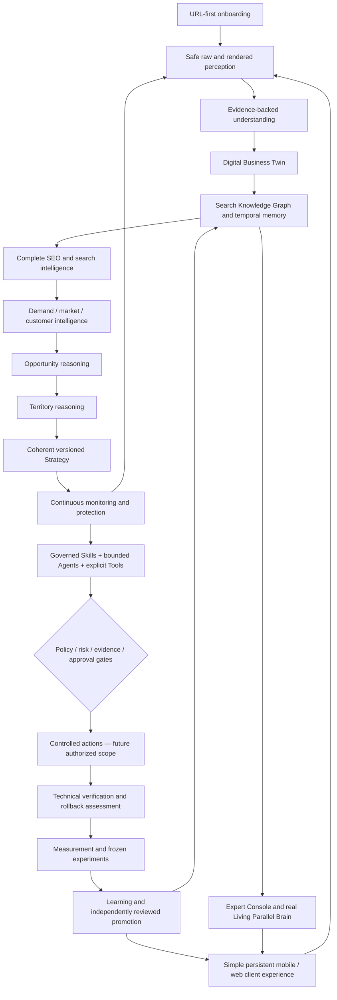

# Permanent end goal

The enduring product is the persistent, domain-native Search Growth Brain described by the [Product Constitution](../docs/00-CONSTITUTION.md), [original vision](../docs/01-CANONICAL-VISION.md) and [Parallel Brain architecture](../docs/03-BRAIN-ARCHITECTURE.md). The local read-only slice is a foundation, not a replacement end goal. The customer supplies a URL; inference precedes questions; the Brain keeps working while the client is closed.

**Backend speaks SEO. Frontend speaks business.** The Brain may reason freely, but it acts only through governed skills and explicit tools. It understands, grows, protects and learns. It is not an SEO dashboard, tools collection, generic chatbot, vendor-bound LLM or website builder. Claim-specific truth/provenance refinements are in [26](../docs/26-TEMPORAL-EVIDENCE-CONTRACT.md); the Constitution is not copied or replaced here.

This graph is the **target dependency/lifecycle map**, not a representation of currently running jobs or a claim that action authority exists. Read current state and capability notes before inferring readiness. All future mutations remain behind their canonical gates.

## Complete search-growth coverage

| End-goal area | Canonical domain owners / navigation |
| --- | --- |
| Technical SEO, crawl, directives, sitemaps, HTTP, URL identity, indexability, JavaScript | CRW, ROB, SMP, HTTP, URL, IDX, JS in [coverage](04-COVERAGE-MATRIX.md) |
| Content and on-page | CNT, PAGE, MAP |
| Information architecture and internal linking | IA, LNK |
| Structured data and media | SD, MED |
| Performance and mobile accessibility to search | PERF |
| Local / Maps | LOC |
| Ecommerce where applicable | COM; applicability from [archetypes](../docs/18-BUSINESS-ARCHETYPE-MATRIX.md) |
| International where applicable | INT; locale and cohort evidence required |
| Google / Search Console | GSC |
| Bing / IndexNow | BING; submission authority is separately gated |
| SERP intelligence and competitors | SERP, COMP |
| Demand / keywords / topics and customers | DEM, AUD, BUS |
| Authority / backlinks | AUTH |
| Brand / entity / reputation | BRAND |
| AI Search / AEO / GEO | AI; no unsupported optimization promises |
| Analytics / conversions | ANA |
| Opportunity / Territory / Strategy | TER and [05](../docs/05-OPPORTUNITY-ACTION-LEARNING.md) |
| Protection, policy and monitoring | CHG, POL, AUDIT |
| Controlled Actions / approvals / verification / rollback | [11](../docs/11-AUTONOMY-AND-GOVERNANCE.md), [05](../docs/05-OPPORTUNITY-ACTION-LEARNING.md); no current write authority |
| Experiments / measurement / learning / memory | EXP, MEM |
| Reporting and client application | UX, [20](../docs/20-CLIENT-INTERPRETATION-MODEL.md) |
| Expert Console and Living Parallel Brain | [06](../docs/06-CLIENT-EXPERT-VISUAL.md), [27](../docs/27-KNOWLEDGE-GRAPH-CONTRACT.md) |

The [195-row catalog](../docs/14-CAPABILITY-TAXONOMY.md) and [capability contract](../docs/15-CAPABILITY-CONTRACT.md) define responsibilities; this map does not add or remove capabilities. Optional connections deepen first value; absence remains explicit, never zero-filled. Future strategy, actions and learning remain visible even while the current work is read-only.
