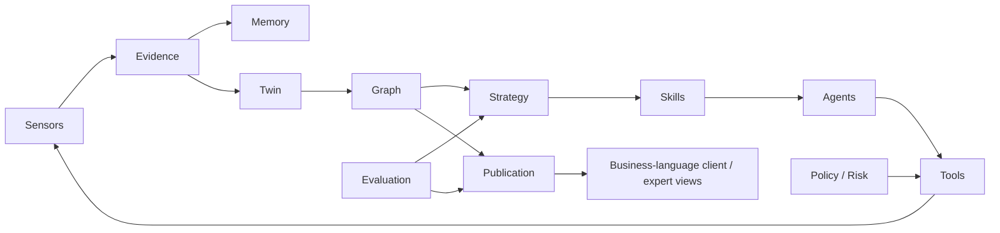

# System map

This is a logical/module index. [03](../docs/03-BRAIN-ARCHITECTURE.md), [08](../docs/08-DOMAIN-MODEL.md), [12](../docs/12-TECHNICAL-ARCHITECTURE-PROPOSAL.md) and accepted [ADRs](07-ADR-INDEX.md) govern boundaries.

| Concept | Responsibility / current implementation evidence | Canonical source |
| --- | --- | --- |
| Brain | Persistent coordination and world-model continuity; no complete always-on production Brain | [03](../docs/03-BRAIN-ARCHITECTURE.md) |
| Strategy | Why/what, priorities and coherent plan revision; [ordering primitive](../packages/understanding/index.ts) is not full strategy | [05](../docs/05-OPPORTUNITY-ACTION-LEARNING.md) |
| Skills | Versioned domain procedures, sources and separate release authority; [registry](../packages/skills/index.ts), draft manifests | [28](../docs/28-SKILL-MANIFEST-SPEC.md) |
| Agents | Bounded missions and explicit tool permissions; contracts, not a fleet of released specialists | [32](../docs/32-AGENT-MISSION-CONTRACT.md) |
| Tools | Explicit typed effects outside reasoning; read-only collection primitives | [04](../docs/04-SKILLS-AGENTS-TOOLS.md), [tool schema](../spec/tool.schema.json) |
| Sensors | Observations with failure/coverage semantics; fixture HTTP and offline renderer; platform adapters absent | [29](../docs/29-SENSOR-CONNECTOR-CONTRACT.md) |
| Evidence | Exact immutable bytes, lineage, scope and cutoffs; [ledger](../packages/persistence/index.ts), [blobs](../packages/evidence/index.ts) | [26](../docs/26-TEMPORAL-EVIDENCE-CONTRACT.md) |
| Memory | What was known/observed when; SQL knowledge clock/bundles; full belief/learning revisions remain | [10](../docs/10-EVENT-AND-TEMPORAL-MODEL.md) |
| Knowledge Graph | Evidence-backed domain relationships; bounded local [projection](../packages/understanding/index.ts), not a decorative neural animation | [27](../docs/27-KNOWLEDGE-GRAPH-CONTRACT.md) |
| Twin | Field-level business world model; literal fixture claims are partial prerequisites | [08](../docs/08-DOMAIN-MODEL.md) |
| Actions | Future governed external changes; disabled/non-executable in current slice | [11](../docs/11-AUTONOMY-AND-GOVERNANCE.md) |
| Evaluation | Frozen criteria, independent gates, uncertainty; transition fixtures are not held-out SEO/model evidence | [35](../docs/35-QUALITY-SELF-AUDIT-GATES.md) |
| Policy / Risk | Deterministic outside agents; [policy](../packages/policy/index.ts), [current input fences](../packages/policy/input-eligibility.ts) | [21](../docs/21-BRAIN-SELF-AUDIT.md), [ADR-007](../docs/decisions/007-audit-effect-scope.md) |
| Durable work | SQL leases, reservations, outbox, deletion/revocation fencing | [jobs](../packages/jobs/index.ts), [33](../docs/33-EVENT-JOB-CONTRACT.md) |
| Client / expert | [API boundary](../packages/api/index.ts), [mobile web shell](../apps/web/index.html); production identity, native app/expert experience not delivered | [06](../docs/06-CLIENT-EXPERT-VISUAL.md) |
| Model infrastructure | Replaceable reasoning adapter contract; [disabled gateway](../packages/understanding/index.ts), no vendor equated with Brain | [31](../docs/31-MODEL-GATEWAY.md) |

The graph above maps architectural responsibilities, not deployment topology. Canonical source freshness and versioning flow through Skills, Evidence and Policy; a provider change cannot change truth rules or grant tool authority.
